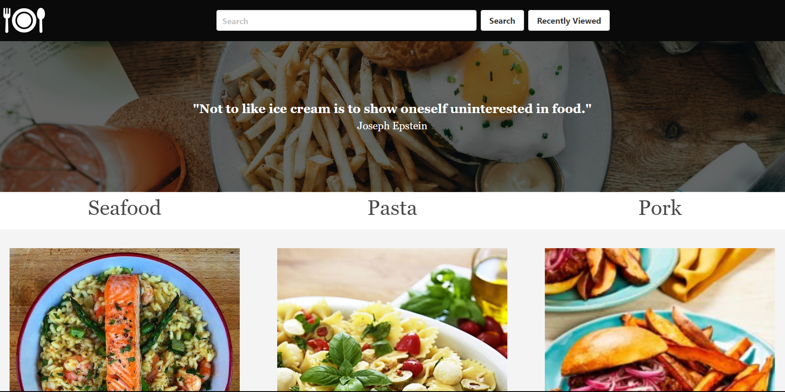

# Recipe Finder

Website Link: [Recipe Finder](https://sharktank3800.github.io/recipe_finder/)

## Description

**This is a web application that interacts with the MealDB API to display meals and recipes. Users can search for meals by categories, enter specific search terms, and view details about individual recipes. Additionally, the application features a recent meals dropdown for quick access to previously viewed recipes.**

## Installation

```
1. Clone the Repository:

git clone https://github.com/sharktank3800/recipe_finder.git


2. Open the `index.html` file in your web browser to launch the application.
```

## Usage

-   Home Page: click on the "Home" Icon logo to return to the home page, where you view random food related quotes
-   Search for meals: Use the search input field and click the search button to search for meals.
-   View Recipe Details: Click on a meal to view its recipe details, including ingredients and cooking instructions.
-   Recent Meals Dropdown: Click the "recently viewed" button to open a dropdown menu containing users recently viewed meals. Clicking on a recent meal item will display its recipe details.



## Features

-   Random food-related quotes on the home page.
-   Search for meals by name or category.
-   View detailed recipe information.
-   Access recently viewed meals from the dropdown menu.

## License

-   This project is licensed under the MIT License.

## Acknowledgments

-   This web application uses the MealDB API to retrieve meal data.
